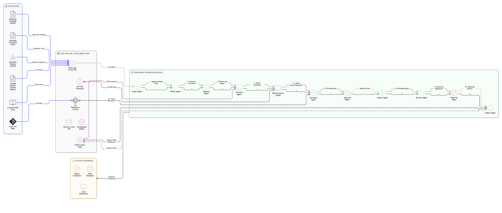

# FinOps AI 

# 1. Install dependencies
pip install gpt4all

# 2. Download the file
# Save "run-finops-complete.py" to your computer

# 3. Run it
python run-finops-complete.py

================================================================================
🏗️  AI FINOPS CLOUD PLAN GENERATOR
================================================================================

📊 Scenario: Web application with REST API, PostgreSQL, Redis, S3
👥 Users: 10,000
⚡ Peak Concurrent: 500

🔧 Initializing GPT4All...
🔄 Loading model: Llama-3.2-3B-Instruct-Q4_0
   Path: C:\Users\OrCon\AppData\Local\nomic.ai\GPT4All
✅ Model loaded!

🚀 Generating cloud architecture plans...

📋 Generating STANDARD plan...
   🤖 Calling LLM...
   ✓ Generated in 12.3s (1245 chars)
   ✅ Standard (Balanced) - $1,100/mo

📋 Generating COST-OPTIMIZED plan...
   🤖 Calling LLM...
   ✓ Generated in 10.8s (1102 chars)
   ✅ Cost-Optimized - $600/mo

📋 Generating SCALABLE plan...
   🤖 Calling LLM...
   ✓ Generated in 14.1s (1389 chars)
   ✅ Scalable (Enterprise) - $2,200/mo

================================================================================
📊 PLAN COMPARISON
================================================================================

🎯 Standard (Balanced)
   💰 Cost: $1,100.00/month
   📈 Scalability: medium
   ⚠️  Risk: medium
   🔧 Components: 6

   Components:
      • LoadBalancer: 1
      • AppServer: 3 x medium
      • Database: Primary + 1 replica
      • Cache: 1 x small Redis
      • ObjectStorage: ~500 GB
      • CDN: CloudFront

🎯 Cost-Optimized
   💰 Cost: $600.00/month
   📈 Scalability: medium
   ⚠️  Risk: medium-high
   🔧 Components: 5

🎯 Scalable (Enterprise)
   💰 Cost: $2,200.00/month
   📈 Scalability: high
   ⚠️  Risk: low
   🔧 Components: 7

💾 Results saved to: outputs/reports/cloud_plans_finops.json

✅ Done!
